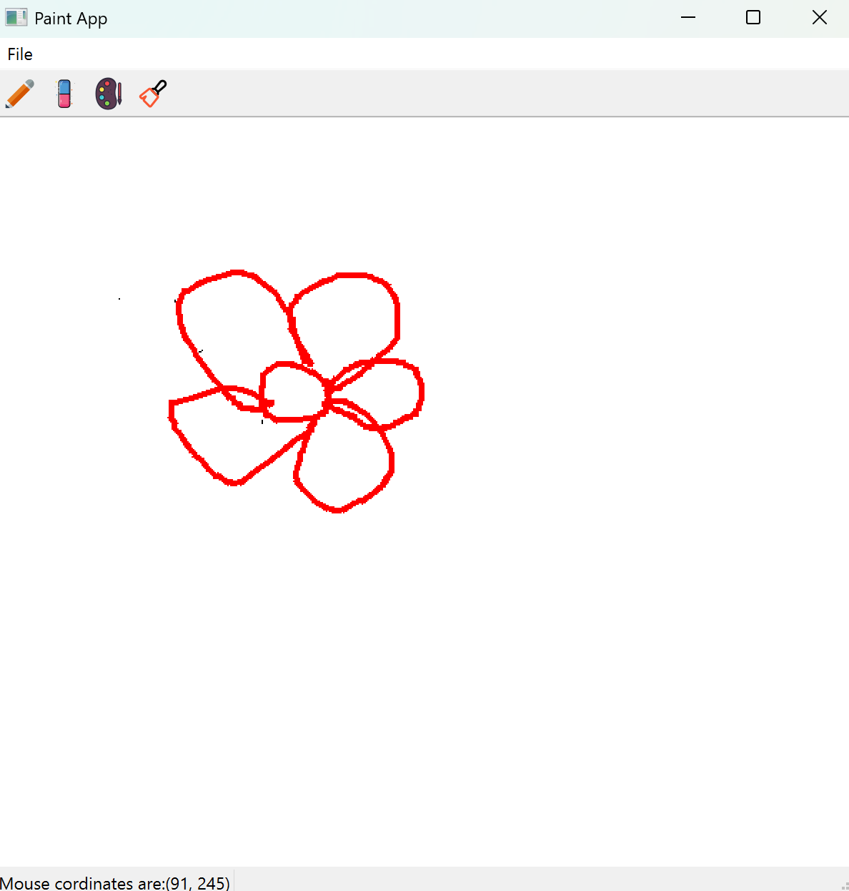

# 🎨 PyQt6 Paint App

A simple and interactive **desktop drawing application** built using **PyQt6**, featuring pencil, brush, eraser, and color picker tools. The app allows freehand drawing with the mouse and supports saving the canvas to an image file.

---

## 🖼️ Features

- ✅ Pencil and Brush tools with adjustable stroke width
- 🧼 Eraser tool
- 🌈 Color picker for custom pen colors
- 💾 Save drawing as a PNG file
- 📄 New (clear canvas)
- 📌 Real-time mouse coordinate display in status bar
- 🛠️ Toolbar and Menu integration for tool selection

---

## 📷 Screenshot


> ```md
> 
> ```

---

## 🚀 Getting Started

### 🔧 Requirements

- Python 3.x
- PyQt6

### 📦 Installation

1.Install the required package:
```bash
pip install PyQt6
```

2.▶️ Running the App
  Save the script as paint_app.py and run:
```
python paint_app.py
```
📁 File Structure
```
PyQt6_Paint_App/
├── paint_app.py         # Main app file
├── pencil.png           # Pencil tool icon
├── eraser.png           # Eraser tool icon
├── brushpaint.png       # Brush tool icon
├── color.png            # Color picker icon
└── README.md            # Project description
```

🔔 Make sure all the icons are in the same directory as paint_app.py

💡 Future Enhancements:
- Add shape drawing (rectangle, circle)

- Add undo/redo functionality

- Export in other formats (JPEG, PDF)

- Add custom brush patterns

